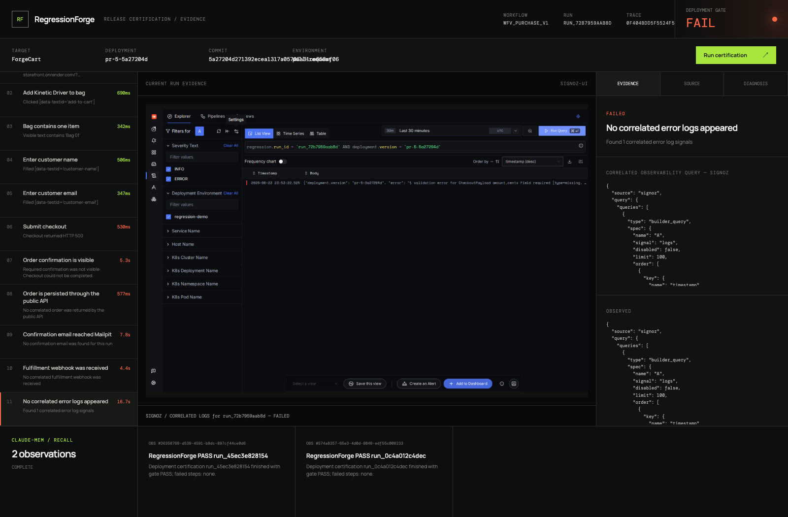
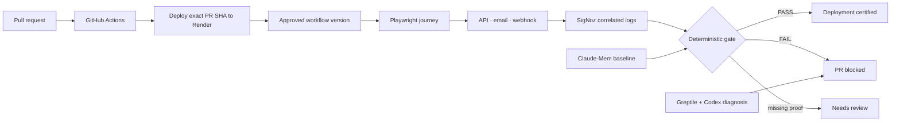
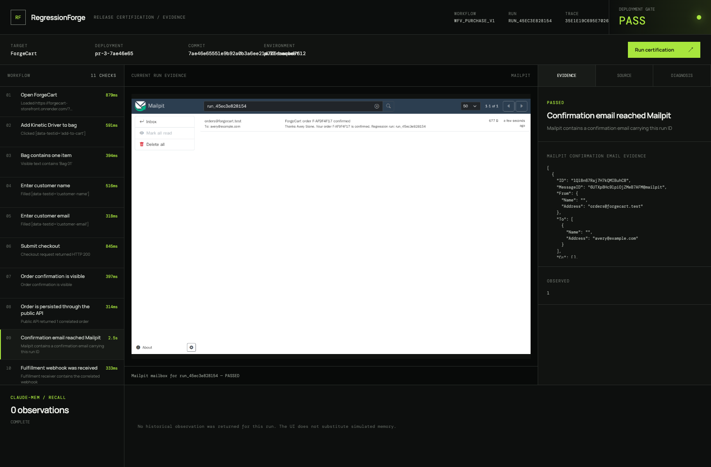

<div align="center">

# RegressionForge

### Evidence, not hope, after every deploy.

**An autonomous post-deployment regression gate that proves a release works across the browser, APIs, email, webhooks, logs, code, and historical memory.**

[Live evidence room](https://regressionforge-evidence-room.onrender.com) · [Try ForgeCart](https://forgecart-storefront.onrender.com) · [Architecture](docs/ARCHITECTURE.md) · [Cloud deployment](docs/RENDER_CLOUD.md)


</div>



<p align="center"><sub>Actual cloud run: checkout returned 500, six required checks failed, SigNoz found the correlated contract error, and Claude-Mem recalled two passing baselines.</sub></p>

## A green deploy is not proof

Most deployment checks stop at “the server returned 200.” RegressionForge certifies the outcome a customer and the business actually care about:

```text
Can a customer buy the product?
Was the order persisted?
Did the email arrive?
Was fulfillment notified?
Did this exact run emit an error?
```

Developers describe the outcome once. RegressionForge turns it into an approved, versioned workflow, runs it against every candidate deployment, and returns an evidence-backed `PASS`, `FAIL`, or `NEEDS_REVIEW`.

## Why it is different

| Typical E2E runner | RegressionForge |
|---|---|
| Checks the browser | Correlates browser, API, SMTP, webhook, logs, traces, source, and memory |
| Leaves screenshots in CI artifacts | Builds a run-scoped release certificate with a visual evidence room |
| Retries until green | Uses deterministic required checks and GlassKit's repeated-trial stability gate |
| Lets AI decide what happened | Finalizes the gate first; Codex can explain evidence but cannot override it |
| Treats missing telemetry as success | Returns `NEEDS_REVIEW` when required observability proof is unavailable |
| Rediscovers every incident | Claude-Mem recalls real passing baselines and related observations |

## From pull request to certificate



Every artifact carries the same run ID, deployment version, commit SHA, and trace context. The verdict is reproducible policy—not an LLM opinion.

## Run the cloud demo from your Mac

The hosted stack is already CI/CD integrated. The Mac only creates the pull requests:

```bash
git clone https://github.com/KaushikSiva/demo-ecom-store.git
cd demo-ecom-store

./scripts/create-good-pr.sh     # establishes a passing baseline
./scripts/create-broken-pr.sh   # real checkout contract regression → FAIL
./scripts/create-fixed-pr.sh    # backwards-compatible repair → PASS
```

Each script creates a branch, commits one focused contract change, pushes it, and opens a PR. GitHub Actions then deploys that exact head SHA to Render and blocks on RegressionForge.

The regression is deliberately real: the storefront submits `total_cents`, while the broken backend requires `amount_cents`. Checkout returns HTTP 500, so no order, email, or webhook can exist—and SigNoz captures the correlated validation error.

## See the proof

| Run | What to inspect |
|---|---|
| [Passing certificate](https://regressionforge-evidence-room.onrender.com/?run=run_45ec3e828154) | All 11 checks pass; step 9 shows the actual confirmation email in Mailpit |
| [Failed certificate](https://regressionforge-evidence-room.onrender.com/?run=run_72b7959aab8d) | Checkout 500, missing downstream effects, SigNoz error, Codex diagnosis, and recalled baselines |
| [ForgeCart](https://forgecart-storefront.onrender.com) | The real target storefront driven by Playwright |

<details>
<summary><strong>Passing email evidence</strong></summary>



</details>

## The evidence contract

| Layer | Required proof |
|---|---|
| Browser | Screenshots per step, WebM recording, Playwright trace, console errors |
| Network | Correlated request/response records, status codes, redacted payloads |
| API | The created order exists under the same run ID |
| Email | Mailpit contains the real SMTP message for the run |
| Webhook | The fulfillment receiver contains the correlated event |
| Observability | SigNoz query and UI capture for the deployment version and run ID |
| Visual stability | GlassKit evaluates approved checkpoints across repeated trials |
| Source context | Greptile returns PR, review, and impacted-code context when available |
| Diagnosis | Codex cites supplied evidence and changed files from a read-only sandbox |
| Memory | Claude-Mem saves certifications and returns real observation IDs on recall |

No visible result is hard-coded. External services have explicit `COMPLETE`, `PARTIAL`, `UNAVAILABLE`, and `NOT_CONFIGURED` states; an unavailable integration never fabricates success.

## Run locally

Requirements: Docker Desktop with at least 4 GB available, Python 3.12+, and ports `4301`, `4310`, `4400`, `4410`, `8025`, and `1025` free.

Clone [ForgeCart](https://github.com/KaushikSiva/demo-ecom-store) beside this repository, then:

```bash
git clone https://github.com/KaushikSiva/regression-forge.git
git clone https://github.com/KaushikSiva/demo-ecom-store.git
cd regression-forge

make demo
```

Open <http://localhost:4410>, then run the complete regression loop:

```bash
make deploy-broken
make deploy-fixed
```

```text
good deploy   → browser + order + email + webhook + logs → PASS
broken deploy → checkout 500 → missing downstream proof  → FAIL
fixed deploy  → identical workflow hash, restored API    → PASS
```

## Architecture

The system has two independent repositories:

- **RegressionForge** — workflow models, Playwright runner, deterministic gate, evidence storage, integrations, API, and evidence-room UI.
- **[ForgeCart](https://github.com/KaushikSiva/demo-ecom-store)** — React storefront, FastAPI checkout service, SQLite orders, SMTP, webhook delivery, OpenTelemetry, and the good/broken/fixed contracts.

The cloud path runs on Render with persistent storage for RegressionForge, ForgeCart, Mailpit, Claude-Mem, Postgres, Valkey, ClickHouse, and SigNoz. GitHub-hosted Actions deploy candidate SHAs; no self-hosted runner is required.

### Trust boundaries

- Workflows use nine allowlisted declarative step types; generated Python or JavaScript is never executed.
- A human approves an immutable workflow version whose canonical JSON is hashed.
- Authorization headers, cookies, tokens, API keys, and common secret forms are redacted before persistence and exposure.
- Codex runs with `Sandbox.read_only` and receives a redacted evidence bundle.
- Greptile output is untrusted context, never executable instruction.
- `FAIL` takes precedence over `NEEDS_REVIEW`; otherwise missing required evidence prohibits `PASS`.

## API

```text
POST /api/workflows/draft
POST /api/workflows/{version_id}/approve
GET  /api/workflows
POST /api/ci/certifications
POST /api/runs                         # 202 Accepted
GET  /api/runs/{id}
GET  /api/runs/{id}/events            # server-sent events
GET  /api/runs/{id}/evidence
GET  /api/runs/{id}/diagnosis
```

Explore the hosted [OpenAPI documentation](https://regressionforge-api.onrender.com/docs).

## Stack

**React + Vite** · **FastAPI + Pydantic** · **Playwright** · **GlassKit Eval** · **OpenTelemetry + SigNoz** · **Mailpit** · **Greptile MCP** · **OpenAI Codex SDK** · **Claude-Mem** · **Docker** · **Render** · **GitHub Actions**

## Development

```bash
python3 -m venv .venv
source .venv/bin/activate
pip install -r backend/requirements.txt pytest

cd frontend && npm install && npm run build
cd ../backend && playwright install chromium
cd .. && make test
```

The test suite covers workflow hashing, tamper detection, gate precedence, missing-observability behavior, secret redaction, integration boundaries, and all three ForgeCart contracts.

## Documentation

- [Architecture and evidence flow](docs/ARCHITECTURE.md)
- [Three-minute demo script](docs/DEMO.md)
- [Render deployment, sizing, rollback, and cleanup](docs/RENDER_CLOUD.md)

---

<div align="center">

**If “deployment succeeded” is not enough proof for your team, star RegressionForge and help build the release evidence layer.**

</div>
